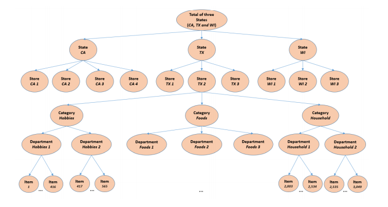

class: inverse, center, middle

# Background

---

# m5 Forecasting - Accuracy

```{r setup, include=FALSE, warning = F, message = F}
knitr::opts_chunk$set(
  echo = F, 
  message = F, 
  warning = F, 
  tidy = F, 
  comment = "#>", 
  results = "asis", 
  fig.width = 10, 
  fig.height = 6, 
  fig.aligh = "center"
)
options(stringsAsFactors = F, digits = 3, htmltools.dir.version = FALSE)

library(tidyverse)
library(knitr)
library(DT)
```

- [Kaggle competition](https://www.kaggle.com/c/m5-forecasting-accuracy/) that ran in 2020
- Participants were given daily sales totals for 3,000 items across 10 stores from 2011-2015
- Asked to forecast sales for the next 15 days



Image credit: [Dipanshu Rana](https://dipanshurana.medium.com/m5-forecasting-accuracy-1b5a10218fcf)

---

# Examples

Test

---

# Overview

I stumbled across [this notebook](https://www.kaggle.com/headsortails/back-to-predict-the-future-interactive-m5-eda) from Kaggle user `headsortails` which introduced me to the competition.  `headsortails` highlights, amongst many other things, that there are six obvious predictors available each of which will have different effects for each store/item.

- Time trend: how sales have changed over time
- Month: sales vary by month
- Day of Week
- SNAP effects: certain days in each state are eligible for SNAP benefits
- Event days: days with special events such as Christmas or the Super Bowl
- Item price
- Natural disasters

---

# Results

*"Pretty clear that if we cannot beat 0.75 significantly we are on the wrong track."* - [Matthias](https://www.kaggle.com/c/m5-forecasting-accuracy/discussion/164599)

```{r}
results_dat <- tribble(
  ~"Entry", ~"Score", ~"Rank", 
  "YeonJun IN_STU", .521, "#1", 
  "Matthias", .528, "#2", 
  "mf", .536, "#3", 
  "Baseline (ES_bu)", .671, "Top 8%", 
  "Baseline (ARIMAX)", .691, "Top 10%", 
  "Basline (sNaive)", .847, "Top 40%"
)

kable(results_dat)
```

---
class: inverse, center, middle

# My Approach

---

# Model Type

This seemed like an interesting challenge that was a good fit for my skillset.  Unlikely most Kaggle competitions, I didn't think that complicated machine learning algorithms were a good fit here for three reasons:

1. It's a hierarchical dataset across stores and items, with time series data.  Approaches would need to account for that structure.
2. While the full dataset has millions of observations, I don't think this is a "big dataset" because we only have ~2000 days worth of data for each individual item at a specific store.
3. The only obvious non-linearity appears to be the overall time trend, and there aren't any obvious interactions.

Instead, I thought the most important part of this problem would be capturing the effects that `headsortails` proposed specific to each item at each store.  This seemed like a classic fit or a hierarchical model.

---

# Model Specification

Ideally, I would fit a two-part model that would appropriately regularize each effect for each specific item/store.  I started with a baseline of just a time trend, month, and weekday effects then progressively added more to the model.

```
m_non0 <- glmer(
  I(sales != 0) ~ f(day) + factor(month) + factor(weekday) + ... + 
    (1 + f(day) + factor(month) + factor(weekday) + ... | store_id) + 
    (1 + f(day) + factor(month) + factor(weekday) + ... | store_id) + 
    (1 + f(day) + factor(month) + factor(weekday) + ... | store_id:item_id), 
  data = data
  family = binomial()
)
m_sales <- glmer(
  sales ~ f(day) + factor(month) + factor(weekday) + ... + 
    (1 + f(day) + factor(month) + factor(weekday) + ... | store_id) + 
    (1 + f(day) + factor(month) + factor(weekday) + ... | store_id) + 
    (1 + f(day) + factor(month) + factor(weekday) + ... | store_id:item_id), 
  data = filter(data, sales > 0), 
  family = binomial()
)
```

---

# Limitations

I wanted to challenge myself to 

- (a) do a Kaggle competition in R on just my laptop[^1]
- (b) use nothing more complicated than Generalized Linear Models
- (c) avoid reviewing the Kaggle discussion and code until completion

[^1]: 16 GB RAM, i7-9750H CPU

---

# My Approach

1. Fit a "global" model to the entire dataset
2. Estimate effects for each specific store, then each specific item, then each item at a specific store  
3. Regularize these noisy effects by applying Regression to the Mean

I started with just a time trend, monthly, and day-of-week effects for a baseline model then iteratively made it more complicated.

---

background-image: url(bda3-cover.png)

???

---

# Data Wrangling


---

# Global Model

```
# Model Specification
f_base <- formula(~ s(day, k = 10, bs = "ts") + 
                    factor(month) + weekday + snap_CA + snap_TX + snap_WI)

# Pr(sales > 0)
m_non0_base <- gam(update(f_base, cbind(non0, n - non0) ~ .), 
                   data = train_dat, 
                   family = binomial())

# E(sales | sales > 0)
m_sales_base <- gam(update(f_base, sales ~ .), 
                    data = filter(train_dat, sales > 0), 
                    family = poisson(), 
                    offset = log(non0))
```

---

# Time Trend

This ended up being more complicated than I expected.  I initially used a polynomial trend, but switched to GAMs because they can algorithmically apply shrinkage.  This broke the rules because it's more complicated than a GLM, but it's a minor infraction.  

```
data_i <- data %>% filter(specified store/item)
m_non0_time_i <- gam(I(sales != 0) ~ s(day, k = 8, bs = "ts"), 
                     data = data_i, 
                     family = binomial(), 
                     offset = lp_non0_base)
m_sales_time_i <- gam(sales ~ s(day, k = 8, bs = "ts"), 
                      data = data_i %>% filter(sales > 0), 
                      family = poisson(), 
                      offset = lp_sales_base)
```

---

# Monthly Effects

Note that a "better" approach may have been to use a seasonal trend, but this appeared to work reasonably well.

```
m_non0_month_i <- gam(I(sales != 0) ~ factor(month), 
                      data = data_i, 
                      family = binomial(), 
                      offset = lp_non0_base)
m_sales_month_i <- gam(sales ~ factor(month), 
                       data = data_i %>% filter(sales > 0), 
                       family = poisson(), 
                       offset = lp_sales_base)
```

---

# Day of Week Effects

Straightforward

```
m_non0_weekday_i <- gam(I(sales != 0) ~ factor(weekday), 
                        data = data_i, 
                        family = binomial(), 
                        offset = lp_non0_base)
m_sales_weekday_i <- gam(sales ~ factor(weekday), 
                         data = data_i %>% filter(sales > 0), 
                         family = poisson(), 
                         offset = lp_sales_base)
```

---
class: inverse, center, middle

# My Results

---

# Baseline results

I was pretty happy with this initial model.  It only used 3 of the 7 predictors, but still outperformed all the baselines and was in the top 10% of submissions.


```{r}
results_dat2 <- tribble(
  ~"Entry", ~"Score", ~"Rank", 
  "YeonJun IN_STU", .521, "#1", 
  "Matthias", .528, "#2", 
  "Alan Lahoud", .536, "#5", 
  "KF Baseline", .669, "#400", 
  "Baseline (ES_bu)", .671, "Top 8%", 
  "Baseline (ARIMAX)", .691, "Top 10%", 
  "Basline (sNaive)", .847, "Top 40%"
)

kable(results_dat2)
```

---

# Adding Complexity

From there, I added in complexity.  My attempts are in order of most -> least complex, so the first (best) model listed includes all the changes of the below models.

```{r}
results_dat3 <- tribble(
  ~"Entry", ~"Score", ~"Rank", ~"Notes", 
  "YeonJun IN_STU", .521, "#1", "", 
  "Alan Lahoud", .536, "#5", "", 
  "KF GAMs", .605, "#111", "Use GAM time trend", 
  "KF SNAP", .607, "#121", "Add SNAP effects", 
  "KF Baseline", .669, "#400", "", 
  "Baseline (ES_bu)", .671, "#415", "", 
)

kable(results_dat3)
```


---
class: inverse, center, middle

# Validation

---

# My Validation Approach

1. Accuracy
2. Calibration
3. Smell Test
4. Feedback

---

# Accuracy

---

# Calibration

---

# Smell Test

---

# Feedback


---
class: inverse, center, middle

# Concluding Thoughts

---

# What I Learned

---

# Additional Work

---

# Conclusion


